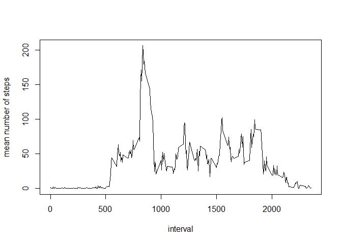

# Reproducible Research: Peer Assessment 1

## Loading and preprocessing the data


```r
setwd("D://Shresht/My stuff/Science/r/rr/cp1/activityd1")
k <- read.csv("activity.csv")
k$time <- sub("(..)$",":\\1",k$interval)
k$datetime <- as.POSIXct(paste(k$date,k$time), format="%Y-%m-%d %H:%M")
```


## What is mean total number of steps taken per day?


```r
lamp <- aggregate(k$steps,by=list(day=k$date),FUN="sum")## total steps per day
hist(lamp$x,main = "Distribution of total distance covered",xlab = "distance")
```

<!-- -->

```r
cam <- aggregate(k$steps,by=list(day=k$date),FUN="mean")## calculates the mean steps per day
jose <- aggregate(k$steps,by=list(day=k$date),FUN="median")
```


## What is the average daily activity pattern?

```r
ka <- k[order(k[,3]),]## ordering the data frame based on intervals
kap <- ka[complete.cases(ka$steps),]## removing the rows with missing values
drog <- aggregate(kap$steps,by=list(i=kap$interval),FUN="mean")## calculates the mean steps per interval
##drog$i <- sub("(..)$",":\\1",drog$i)
plot(drog$i,drog$x,type = "l",xlab = "interval",ylab = "mean number of steps")
```

<!-- -->

```r
drog[which.max(drog$x),]
```

```
##       i        x
## 104 835 206.1698
```


## Imputing missing values

We calculate the total number of missing values in the entire set.To then fill in the missing values in the set,we calculate the mean of the interval of which the value belongs to.The average of that interval is filled in for the missing value.

```r
kapa <- ka[!complete.cases(ka$steps),] ## data frame with only missing values
length(kapa$steps) ## total number of missing values in the 'steps' vector in the data frame
```

```
## [1] 2304
```

```r
################# I am going to replace the NA values in each interval by the mean of that interval
library(plyr)
impute.mean <- function(x)replace(x,is.na(x),mean(x,na.rm=TRUE))
ka2 <- ddply(ka,~interval,transform,steps=impute.mean(steps))
ka2 <- ka2[order(ka2$interval),]
```
The code below represents code used for generating a histogram for the total distance covered per day after the missing values are filled in

```r
lamp2 <- aggregate(ka2$steps,by=list(day=ka2$date),FUN="sum")
hist(lamp2$x,main = "Distribution of total distance covered",xlab = "distance")
```

<!-- -->

```r
cam2 <- aggregate(ka2$steps,by=list(interval=ka2$interval),FUN="mean")
jose2 <- aggregate(ka2$steps,by=list(interval=ka2$interval),FUN="median")
```

## Are there differences in activity patterns between weekdays and weekends?
Now we are going to crete a time series plot for average distance covered per interval based on whether it's a weekday or weekend.

```r
ka2$weekend = chron::is.weekend(ka2$date)
ka21 <- aggregate(ka2$steps~ka2$interval+ka2$weekend,ka2,mean)
names(ka21) <- c("interval","Weekend?","steps")
par(mfrow=c(1,1))
with(ka21,plot(steps~interval,type="n",main="Weekday vs weekend avg"))
with(ka21[ka21$`Weekend?`=="TRUE",],lines(steps~interval),type="l",col="blue")
with(ka21[ka21$`Weekend?`=="FALSE",],lines(steps~interval),type="l",col="16")
```

<!-- -->
